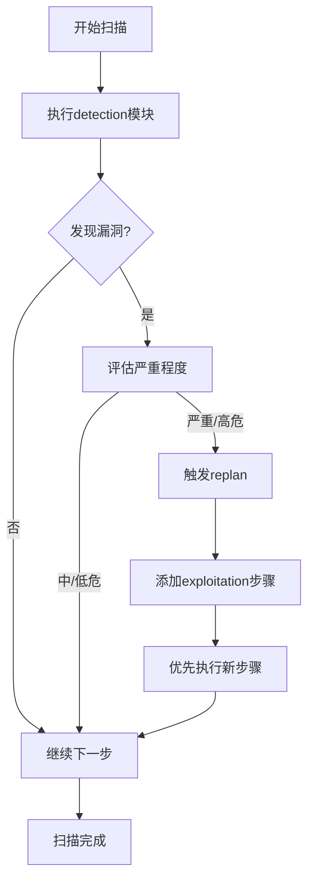
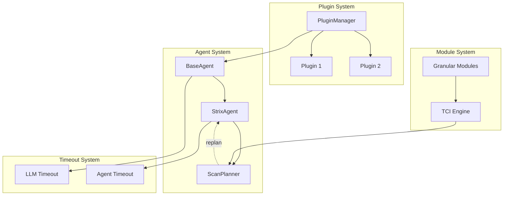

# Strix 架构改进文档

本文档详细说明了Strix的最新架构改进,包括插件系统、细粒度模块、实时重规划和超时机制。

---

## 1. 插件架构 (Plugin Architecture)

### 概述

插件系统允许开发者通过插件扩展Strix的功能,无需修改核心代码。插件可以提供:
- 自定义工具 (Tools)
- 提示模板 (Prompt Modules)
- TCI权重配置 (TCI Weights)

### 核心组件

#### Plugin 基类

```python
from strix.core.plugin import Plugin

class MyPlugin(Plugin):
    def __init__(self):
        super().__init__()
        self.metadata.name = "MyPlugin"
        self.metadata.version = "1.0.0"
        self.metadata.description = "My custom plugin"
    
    def get_tools(self) -> list[Any]:
        """返回插件提供的工具列表"""
        return [my_custom_tool]
    
    def get_prompt_modules(self) -> dict[str, str]:
        """返回插件提供的提示模板"""
        return {
            "my_module": "Custom prompt template content"
        }
    
    def on_load(self):
        """插件加载时调用"""
        print("MyPlugin loaded")
```

#### PluginManager

```python
from strix.core.plugin import get_plugin_manager

# 获取全局插件管理器
pm = get_plugin_manager()

# 加载单个插件
pm.load_plugin(MyPlugin)

# 从目录加载所有插件
from pathlib import Path
pm.load_plugins_from_dir(Path("~/.strix/plugins"))

# 获取所有已加载的工具
tools = pm.get_all_tools()

# 获取所有提示模板
prompts = pm.get_all_prompt_modules()
```

### 插件目录结构

```
~/.strix/plugins/
├── my_plugin.py          # 单文件插件
└── complex_plugin/       # 多文件插件
    ├── __init__.py
    ├── plugin.py
    └── tools.py
```

### 示例插件

```python
# ~/.strix/plugins/sql_scanner.py
from strix.core.plugin import Plugin
from strix.tools.registry import register_tool

class SQLScannerPlugin(Plugin):
    def __init__(self):
        super().__init__()
        self.metadata.name = "SQLScanner"
        self.metadata.version = "1.0.0"
    
    def get_tools(self):
        @register_tool()
        def advanced_sql_scan(target: str) -> dict:
            """Advanced SQL injection scanner"""
            # 实现自定义SQL扫描逻辑
            return {"vulnerabilities": []}
        
        return [advanced_sql_scan]
    
    def get_prompt_modules(self):
        return {
            "sql_expert": """
You are an expert in SQL injection testing.
Focus on:
- Time-based blind SQL injection
- Boolean-based blind SQL injection
- Error-based SQL injection
"""
        }
```

### 集成方式

插件系统已集成到:
1. **main.py** - 启动时自动加载插件
2. **BaseAgent** - 支持从插件加载提示模板
3. **Tools Registry** - 自动注册插件工具

---

## 2. 细粒度模块 (Granular Modules)

### 概述

细粒度模块将广泛的漏洞类型细分为更具体的子模块,实现更精确的扫描控制。

### 模块命名规范

使用点号分隔的层级命名:
```
<漏洞类型>.<子类型>.<具体方法>
```

### 已实现的细粒度模块

#### SQL注入模块

```python
# 通用模块
"sql_injection"                    # SQL注入(通用)

# 细粒度模块
"sql_injection.detection"          # 检测SQL注入点
"sql_injection.exploitation"       # 利用SQL注入漏洞
```

#### XSS模块

```python
# 通用模块
"xss"                              # XSS(通用)

# 细粒度模块
"xss.reflected"                    # 反射型XSS
"xss.stored"                       # 存储型XSS
"xss.dom"                          # DOM型XSS
```

### 配置示例

在 `strix/agents/planner.py` 中:

```python
MODULE_DESCRIPTIONS = {
    "sql_injection.detection": "Detect potential SQL injection points",
    "sql_injection.exploitation": "Attempt to exploit SQL injection vulnerabilities",
    "xss.reflected": "Test for Reflected XSS",
    "xss.stored": "Test for Stored XSS",
    "xss.dom": "Test for DOM-based XSS",
}

MODULE_TIMEOUTS = {
    "sql_injection.detection": 300,      # 5分钟
    "sql_injection.exploitation": 600,   # 10分钟
    "xss.reflected": 300,
    "xss.stored": 450,
    "xss.dom": 300,
}
```

### TCI推荐逻辑

```python
# strix/core/tci.py
MODULE_RECOMMENDATIONS = {
    "has_database": ["sql_injection.detection", "sql_injection.exploitation"],
    "has_user_input": ["xss.reflected", "xss.stored", "xss.dom"],
}
```

### 使用场景

1. **渐进式扫描**: 先运行detection,发现漏洞后再运行exploitation
2. **精确控制**: 只扫描特定类型的XSS
3. **资源优化**: 根据目标特征选择合适的子模块

---

## 3. 实时重规划 (Real-time Re-planning)

### 概述

实时重规划允许agent根据扫描过程中发现的漏洞动态调整扫描计划,自动添加利用步骤。

### 核心机制

#### ScanPlanner.replan()

```python
def replan(
    self,
    current_plan: ScanPlan,
    new_findings: list[dict[str, Any]],
) -> ScanPlan:
    """根据新发现更新扫描计划
    
    Args:
        current_plan: 当前扫描计划
        new_findings: 新发现的漏洞列表
        
    Returns:
        更新后的扫描计划
    """
    for finding in new_findings:
        severity = finding.get("severity", "low").lower()
        vuln_type = finding.get("type", "unknown").lower()
        
        # 对严重/高危漏洞添加利用步骤
        if severity in ["critical", "high"]:
            exploit_module = f"{vuln_type}.exploitation"
            
            if exploit_module in MODULE_DESCRIPTIONS:
                # 检查是否已存在
                if not any(s.module == exploit_module for s in current_plan.steps):
                    # 添加新步骤
                    step = self._create_step(
                        module=exploit_module,
                        priority=PlanPriority.CRITICAL,
                        phase=ScanPhase.EXPLOITATION,
                        ...
                    )
                    current_plan.steps.append(step)
    
    return current_plan
```

#### StrixAgent集成

```python
async def _process_iteration(self, tracer: Optional[Tracer]) -> bool:
    # 执行正常逻辑
    should_finish = await super()._process_iteration(tracer)
    
    # 检查新发现
    if tracer and tracer.vulnerability_reports:
        new_findings = [...]  # 过滤新发现
        
        if new_findings and self.current_plan:
            # 触发重规划
            updated_plan = self.planner.replan(self.current_plan, new_findings)
            
            # 通知agent
            critical_findings = [f for f in new_findings 
                               if f.get("severity") in ["critical", "high"]]
            if critical_findings:
                self.state.add_message("user", 
                    f"发现{len(critical_findings)}个严重漏洞,已更新扫描计划")
    
    return should_finish
```

### 工作流程



### 示例场景

```python
# 初始计划
initial_plan = [
    "reconnaissance",
    "enumeration",
    "sql_injection.detection",  # 检测SQL注入
    "xss.reflected",
]

# 发现严重SQL注入
finding = {
    "type": "sql_injection",
    "severity": "critical",
    "location": "param id"
}

# 重规划后
updated_plan = [
    "reconnaissance",
    "enumeration",
    "sql_injection.detection",
    "sql_injection.exploitation",  # 自动添加
    "xss.reflected",
]
```

---

## 4. Agent超时机制 (Agent Timeout)

### 概述

防止agent因LLM无响应而hang住,通过多层超时保护确保扫描流程不会卡死。

### 两层防护机制

#### 第一层: LLM请求超时

```python
# strix/agents/base_agent.py
async def _process_iteration(self, tracer: Optional["Tracer"]) -> bool:
    try:
        # 超时 = LLM配置超时 + 60秒缓冲
        timeout_seconds = self.llm.config.timeout + 60
        
        response = await asyncio.wait_for(
            self.llm.generate(self.state.get_conversation_history()),
            timeout=timeout_seconds
        )
    except asyncio.TimeoutError:
        # 子agent优雅退出
        if self.state.parent_id:
            self.state.set_completed({"success": False, "error": "timeout"})
            return True
        # 根agent抛出异常
        raise LLMRequestFailedError("LLM request timed out")
```

#### 第二层: Agent级别超时

```python
# strix/tools/agents_graph/agents_graph_actions.py
def create_agent(
    timeout_minutes: int | None = None,  # 默认30分钟
):
    # 从环境变量获取
    if timeout_minutes is None:
        timeout_minutes = int(os.getenv("AGENT_TIMEOUT_MINUTES", "30"))
    
    # 启动监控线程
    def _monitor_timeout():
        time.sleep(timeout_minutes * 60)
        if state.agent_id in _running_agents:
            logger.warning(f"Agent {state.agent_id} timed out")
            stop_agent(state.agent_id)
    
    monitor_thread = threading.Thread(target=_monitor_timeout, daemon=True)
    monitor_thread.start()
```

### 配置参数

#### 环境变量

```bash
# LLM请求超时(秒)
export LLM_TIMEOUT=600

# Agent最大运行时间(分钟)
export AGENT_TIMEOUT_MINUTES=30
```

#### 代码配置

```python
# 创建agent时指定超时
create_agent(
    agent_state=current_state,
    task="Deep scan",
    name="Scanner",
    timeout_minutes=60  # 60分钟
)
```

### 超时行为

| 场景 | 行为 | 影响 |
|------|------|------|
| 子agent LLM超时 | 优雅退出,返回错误 | 父agent继续运行 |
| 根agent LLM超时 | 抛出异常 | 扫描终止 |
| Agent运行超时 | 强制终止 | 释放资源 |

### 最佳实践

1. **根据任务复杂度调整超时**
   ```python
   # 简单扫描
   timeout_minutes=15
   
   # 深度分析
   timeout_minutes=60
   ```

2. **监控超时日志**
   ```bash
   grep "timed out" strix.log
   ```

3. **合理设置LLM超时**
   ```bash
   # 快速模型
   export LLM_TIMEOUT=300
   
   # 慢速模型
   export LLM_TIMEOUT=900
   ```

---

## 5. 架构图



---

## 6. 使用示例

### 完整扫描流程

```python
from strix.agents import StrixAgent
from strix.core.plugin import get_plugin_manager
from strix.core.tci import TargetFingerprint, compute_tci
from strix.agents.planner import ScanPlanner

# 1. 加载插件
pm = get_plugin_manager()
pm.load_plugins_from_dir(Path("~/.strix/plugins"))

# 2. 创建目标指纹
fingerprint = TargetFingerprint(
    open_ports=[80, 443],
    technologies=["mysql", "php"],
    has_user_input=True,
    databases=["mysql"]
)

# 3. 计算TCI
tci_result = compute_tci(fingerprint)
# 推荐模块: ["sql_injection.detection", "xss.reflected", ...]

# 4. 生成扫描计划
planner = ScanPlanner()
plan = planner.generate_plan(
    target="https://example.com",
    fingerprint=fingerprint,
    tci_result=tci_result
)

# 5. 执行扫描
agent = StrixAgent(config)
agent.current_plan = plan

result = await agent.execute_scan({
    "targets": [{"type": "web_application", "details": {"target_url": "https://example.com"}}]
})

# 6. 实时重规划会自动触发
# 如果发现严重SQL注入,会自动添加exploitation步骤
```

---

## 7. 故障排查

### 插件未加载

```bash
# 检查插件目录
ls -la ~/.strix/plugins/

# 查看日志
grep "plugin" strix.log
```

### Agent超时

```bash
# 增加超时时间
export AGENT_TIMEOUT_MINUTES=60

# 检查LLM响应
export LLM_TIMEOUT=900
```

### 重规划未触发

```python
# 确保StrixAgent初始化了planner
assert agent.planner is not None
assert agent.current_plan is not None

# 检查漏洞报告格式
finding = {
    "type": "sql_injection",  # 必须
    "severity": "critical",   # 必须
    "location": "..."
}
```

---

## 8. 性能考虑

- **插件加载**: 启动时一次性加载,无运行时开销
- **细粒度模块**: 不增加内存,只是更精细的分类
- **实时重规划**: 每次迭代检查,开销<1ms
- **超时监控**: 每个agent一个daemon线程,~1KB内存

---

## 9. 安全注意事项

> [!WARNING]
> - 只从可信来源加载插件
> - 插件可以执行任意代码
> - 建议在沙箱环境测试新插件

> [!IMPORTANT]
> - 超时时间不宜过短
> - 监控agent超时日志
> - 定期审查插件代码
