# 13. Scope System Architecture

This diagram illustrates the complete scope system including models, parsing, validation, templates, telemetry integration, root agent coordination, role-based tool access, and progress tracking.

## Sequence Diagram

```mermaid
sequenceDiagram
    autonumber

    participant User as User/CLI
    participant Template as Scope Templates
    participant Parser as ScopeConfigParser
    participant Models as Scope Models
    participant Validator as ScopeValidator
    participant Telemetry as Telemetry Tracer
    participant RootAgent as Root Agent
    participant Registry as Tool Registry
    participant SubAgent as Sub-Agents
    participant Progress as Progress Tracker
    participant Storage as File Storage

    %% ══════════════════════════════════════════════════════════════
    %% PHASE 1: SCOPE CONFIGURATION LOADING
    %% ══════════════════════════════════════════════════════════════
    rect rgb(40, 60, 80)
        Note over User,Storage: Phase 1: Scope Configuration Loading

        User->>Template: Request scope template
        Template-->>User: Return scope.yaml/json/csv template

        Note right of User: User fills in:<br/>- Engagement metadata<br/>- Target definitions<br/>- Network ranges<br/>- Exclusions<br/>- Credentials<br/>- Test focus areas

        User->>Parser: parse_file(scope_file_path)

        alt YAML Format
            Parser->>Parser: _parse_yaml(path)
        else JSON Format
            Parser->>Parser: _parse_json(path)
        else CSV Format
            Parser->>Parser: _parse_csv(path)
        end

        Parser->>Models: Create ScopeConfig from dict

        Note over Models: Pydantic Models:<br/>- ScopeMetadata<br/>- ScopeSettings<br/>- TargetDefinition<br/>- NetworkDefinition<br/>- CredentialDefinition<br/>- ExclusionDefinition<br/>- DomainScope

        Models->>Models: Validate field types
        Models->>Models: compute_network_info()
        Models->>Models: compute_exclusion_networks()
        Models->>Models: compile domain patterns
        Models->>Models: build_indexes()

        Models-->>Parser: Return ScopeConfig instance

        Parser->>Parser: resolve_env_vars(config)
        Note right of Parser: Resolve credential<br/>environment variables:<br/>PASSWORD_ENV → value<br/>TOKEN_ENV → value<br/>API_KEY_ENV → value

        Parser-->>User: Return validated ScopeConfig
    end

    %% ══════════════════════════════════════════════════════════════
    %% PHASE 2: SCOPE VALIDATION
    %% ══════════════════════════════════════════════════════════════
    rect rgb(60, 40, 80)
        Note over User,Storage: Phase 2: Multi-Phase Validation

        User->>Validator: validate(scope_config)

        Validator->>Validator: Phase 1: METADATA
        Note right of Validator: - engagement_name required<br/>- date validation (end > start)<br/>- tester warning if missing

        Validator->>Validator: Phase 2: NETWORKS
        Note right of Validator: - Duplicate name check<br/>- Valid CIDR format<br/>- Gateway in network<br/>- VLAN range (1-4094)

        Validator->>Validator: Phase 3: TARGETS
        Note right of Validator: - At least one identifier<br/>- Duplicate names<br/>- Valid hosts/URLs<br/>- Valid ports (1-65535)

        Validator->>Validator: Phase 4: CREDENTIALS
        Note right of Validator: - Env vars set<br/>- Plaintext secret warnings<br/>- Auth method present

        Validator->>Validator: Phase 5: MODULES
        Note right of Validator: - Known prompt modules<br/>- Max 5 modules/target

        Validator->>Validator: Phase 6: EXCLUSIONS
        Note right of Validator: - Valid CIDR<br/>- Valid hosts/ports

        Validator->>Validator: Phase 7: CROSS_REFERENCE
        Note right of Validator: - Network refs exist<br/>- Targets in networks

        Validator-->>User: ValidationResult
        Note right of User: ValidationResult:<br/>- is_valid: bool<br/>- issues: ValidationIssue[]<br/>- warnings_count<br/>- errors_count

        alt Validation Failed
            User->>User: Display errors & suggestions
            User->>Template: Edit scope file
        end
    end

    %% ══════════════════════════════════════════════════════════════
    %% PHASE 3: TELEMETRY INITIALIZATION
    %% ══════════════════════════════════════════════════════════════
    rect rgb(40, 80, 60)
        Note over User,Storage: Phase 3: Telemetry & Context Setup

        User->>Telemetry: Initialize Tracer(run_id, run_name)

        User->>User: Build scope_context dict
        Note right of User: scope_context = {<br/>  metadata: {...}<br/>  settings: {...}<br/>  networks: [...]<br/>  targets: [...]<br/>  exclusions: {...}<br/>  domains: {...}<br/>  test_focus: {...}<br/>}

        User->>Telemetry: log_scope_loaded(scope_context)

        Telemetry->>Telemetry: Emit SCOPE_LOADED event
        Telemetry->>Storage: Write to events.jsonl

        Note over Telemetry: Event Data:<br/>- engagement_name<br/>- targets_count<br/>- networks_count<br/>- operational_mode

        Telemetry->>Telemetry: Store scope_context globally
        Note right of Telemetry: Available to all<br/>agents during scan
    end

    %% ══════════════════════════════════════════════════════════════
    %% PHASE 4: ROOT AGENT INITIALIZATION
    %% ══════════════════════════════════════════════════════════════
    rect rgb(80, 60, 40)
        Note over User,Storage: Phase 4: Root Agent Initialization

        User->>RootAgent: Create StrixAgent(scope_context)

        RootAgent->>RootAgent: Load root_agent.jinja prompt
        RootAgent->>RootAgent: Inject scope_context into prompt

        Note over RootAgent: Prompt includes:<br/>- Engagement details<br/>- Operational mode<br/>- Target list<br/>- Exclusions<br/>- Test focus areas

        RootAgent->>Registry: get_tools_for_role(COORDINATOR)

        Registry->>Registry: Lookup TOOL_PROFILES[COORDINATOR]
        Note right of Registry: COORDINATOR tools:<br/>- agents_graph<br/>- finish<br/>- thinking<br/>- notes

        Registry-->>RootAgent: Tool definitions (XML schema)

        RootAgent->>RootAgent: Initialize AgentState
        Note right of RootAgent: AgentState:<br/>- agent_id<br/>- parent_id: None<br/>- role: COORDINATOR<br/>- iteration: 0<br/>- context: scope_context
    end

    %% ══════════════════════════════════════════════════════════════
    %% PHASE 5: AGENT EXECUTION LOOP
    %% ══════════════════════════════════════════════════════════════
    rect rgb(60, 80, 80)
        Note over User,Storage: Phase 5: Agent Execution Loop

        loop Until max_iterations or scan complete
            RootAgent->>RootAgent: Build LLM prompt with scope
            RootAgent->>RootAgent: Query LLM for next action

            alt Create Sub-Agent
                RootAgent->>Registry: get_tools_for_role(role)
                Note right of Registry: Role options:<br/>- RECONNAISSANCE<br/>- VULNERABILITY_TESTER<br/>- VALIDATOR<br/>- REPORTER<br/>- FIX_GENERATOR

                Registry-->>RootAgent: Role-specific tools

                RootAgent->>SubAgent: Create agent with role & target
                SubAgent->>SubAgent: Initialize with scope_context

                SubAgent->>Telemetry: log_agent_created(agent_id, role, target)
                Telemetry->>Storage: Write AGENT_CREATED event

            else Execute Tool
                RootAgent->>Registry: is_tool_allowed_for_role(tool, role)

                alt Tool Allowed
                    Registry-->>RootAgent: true
                    RootAgent->>RootAgent: Execute tool
                    RootAgent->>Telemetry: log_tool_execution(tool, result)
                    Telemetry->>Storage: Write TOOL_START/TOOL_END events
                else Tool Not Allowed
                    Registry-->>RootAgent: false
                    RootAgent->>RootAgent: Return error response
                    Note right of RootAgent: "Tool not allowed<br/>for COORDINATOR role"
                end

            else Save Progress
                RootAgent->>Progress: save_progress(checkpoint, data)
                Progress->>Storage: Write checkpoint JSON
                Progress-->>RootAgent: {success, file_path}

                RootAgent->>Telemetry: log_progress_update(phase, progress%)
                Telemetry->>Storage: Write PROGRESS_UPDATE event
            end

            RootAgent->>RootAgent: increment_iteration()
        end
    end

    %% ══════════════════════════════════════════════════════════════
    %% PHASE 6: SUB-AGENT EXECUTION
    %% ══════════════════════════════════════════════════════════════
    rect rgb(80, 40, 60)
        Note over User,Storage: Phase 6: Sub-Agent Execution with Role-Based Access

        SubAgent->>SubAgent: Receive task from root agent

        SubAgent->>Telemetry: log_scope_target_start(target)
        Telemetry->>Storage: Write SCOPE_TARGET_START event

        loop Sub-agent iterations
            SubAgent->>SubAgent: Query LLM with task + scope

            SubAgent->>Registry: is_tool_allowed_for_role(tool, agent_role)

            alt RECONNAISSANCE Role
                Note right of Registry: Allowed tools:<br/>- terminal<br/>- proxy<br/>- browser<br/>- web_search<br/>- python<br/>- notes, thinking
            else VULNERABILITY_TESTER Role
                Note right of Registry: Allowed tools:<br/>- terminal<br/>- proxy<br/>- browser<br/>- python<br/>- file_edit<br/>- reporting<br/>- agents_graph
            else VALIDATOR Role
                Note right of Registry: Allowed tools:<br/>- terminal<br/>- proxy<br/>- browser<br/>- python<br/>- notes, thinking
            else REPORTER Role
                Note right of Registry: Allowed tools:<br/>- notes<br/>- reporting<br/>- file_edit<br/>- thinking
            else FIX_GENERATOR Role
                Note right of Registry: Allowed tools:<br/>- file_edit<br/>- python<br/>- notes, thinking
            end

            Registry-->>SubAgent: Tool allowed/denied

            alt Tool Execution
                SubAgent->>SubAgent: Execute allowed tool
                SubAgent->>Telemetry: log_tool_execution()
            end

            alt Vulnerability Found
                SubAgent->>Telemetry: log_vulnerability_found(vuln_data)
                Telemetry->>Storage: Write VULNERABILITY_FOUND event
            end

            SubAgent->>Progress: save_progress(checkpoint, findings)
            Progress->>Storage: Write progress checkpoint
        end

        SubAgent->>Telemetry: log_scope_target_end(target, results)
        Telemetry->>Storage: Write SCOPE_TARGET_END event

        SubAgent-->>RootAgent: Return findings to parent
    end

    %% ══════════════════════════════════════════════════════════════
    %% PHASE 7: PROGRESS & RESUME
    %% ══════════════════════════════════════════════════════════════
    rect rgb(60, 60, 80)
        Note over User,Storage: Phase 7: Progress Tracking & Resume

        User->>Progress: list_progress()
        Progress->>Storage: Read progress directory
        Progress-->>User: {checkpoints[], count}

        User->>Progress: load_progress(checkpoint_name)
        Progress->>Storage: Read checkpoint JSON
        Progress-->>User: {data, metadata, created_at}

        Note over Progress: Checkpoint contains:<br/>- checkpoint_name<br/>- run_id, run_name<br/>- data (findings, state)<br/>- metadata (agent_id, iteration)

        User->>RootAgent: Resume with loaded state
        RootAgent->>RootAgent: Restore context from checkpoint
        RootAgent->>Telemetry: log_progress_update("resumed", 0, "Scan resumed")
    end

    %% ══════════════════════════════════════════════════════════════
    %% PHASE 8: SCAN COMPLETION
    %% ══════════════════════════════════════════════════════════════
    rect rgb(40, 80, 80)
        Note over User,Storage: Phase 8: Scan Completion & Reporting

        RootAgent->>RootAgent: Call finish tool

        RootAgent->>Telemetry: log_scan_end(summary)
        Telemetry->>Storage: Write SCAN_END event

        RootAgent->>Progress: save_progress("final", all_findings)
        Progress->>Storage: Write final checkpoint

        RootAgent-->>User: Return scan results

        Note over User: Output files:<br/>- events.jsonl (telemetry)<br/>- vulnerabilities.json<br/>- progress/*.json<br/>- scan_report.md
    end
```



## Component Descriptions

### 1. Scope Models (`strix/scope/models.py`)

Pydantic data models defining the structure of scope configurations:

| Model | Purpose | Key Fields |
|-------|---------|------------|
| `ScopeConfig` | Root configuration | metadata, settings, networks, targets, exclusions, domains, test_focus |
| `ScopeMetadata` | Engagement info | engagement_name, engagement_type, start_date, end_date, tester, client |
| `ScopeSettings` | Operational config | operational_mode, max_agents, max_iterations, timeout_minutes |
| `TargetDefinition` | Test targets | host/url/repo/path, type, credentials, ports, tags, focus_areas |
| `NetworkDefinition` | Network ranges | cidr, name, type, gateway, vlan |
| `CredentialDefinition` | Auth credentials | username, password_env, token_env, api_key_env, access_level |
| `ExclusionDefinition` | Out-of-scope | hosts, cidrs, urls, paths, ports, services |
| `DomainScope` | Domain filtering | in_scope, out_of_scope, patterns |

### 2. Scope Parser (`strix/scope/config.py`)

Parses scope files from multiple formats:

| Method | Format | Description |
|--------|--------|-------------|
| `parse_file()` | Auto-detect | Main entry point, detects format by extension |
| `_parse_yaml()` | YAML | Full-featured scope definition |
| `_parse_json()` | JSON | Equivalent to YAML |
| `_parse_csv()` | CSV | Simplified target-only format |
| `resolve_env_vars()` | - | Resolves environment variable references |

### 3. Scope Validator (`strix/scope/validator.py`)

7-phase validation pipeline:

| Phase | Validates |
|-------|-----------|
| METADATA | Engagement name, dates, tester |
| NETWORKS | CIDR format, duplicates, gateway |
| TARGETS | Identifiers, ports, URLs |
| CREDENTIALS | Environment variables, plaintext warnings |
| MODULES | Known modules, count limits |
| EXCLUSIONS | CIDR format, hosts, ports |
| CROSS_REFERENCE | Network references, target placement |

### 4. Scope Templates (`templates/scope/`)

Pre-built templates for creating scope files:

- `scope.yaml` - Full YAML template with all options
- `scope.json` - JSON equivalent
- `scope-simple.csv` - Quick CSV format for targets

### 5. Telemetry Tracer (`strix/telemetry/tracer.py`)

Event tracking for scope lifecycle:

| Event | When Emitted |
|-------|--------------|
| `SCOPE_LOADED` | Scope config initialized |
| `SCOPE_TARGET_START` | Begin testing target |
| `SCOPE_TARGET_END` | Complete target testing |
| `PROGRESS_UPDATE` | Phase/progress changes |
| `PHASE_CHANGE` | Operational mode transitions |

### 6. Root Agent (`strix/agents/StrixAgent/`)

Coordinates the security assessment:

- Receives scope_context in prompt template
- Enforces operational_mode restrictions
- Creates sub-agents for specific targets/tasks
- Limited to COORDINATOR role tools

### 7. Role-Based Tool Access (`strix/tools/registry.py`)

| Role | Purpose | Tools |
|------|---------|-------|
| COORDINATOR | Orchestrate scan | agents_graph, finish, thinking, notes |
| RECONNAISSANCE | Information gathering | terminal, proxy, browser, web_search, python |
| VULNERABILITY_TESTER | Active testing | terminal, proxy, browser, python, file_edit, reporting |
| VALIDATOR | Verify findings | terminal, proxy, browser, python |
| REPORTER | Documentation | notes, reporting, file_edit |
| FIX_GENERATOR | Create patches | file_edit, python, notes |
| FULL_ACCESS | Unrestricted | All tools |

### 8. Progress Tracking (`strix/tools/progress/progress_actions.py`)

Checkpoint management:

| Function | Purpose |
|----------|---------|
| `save_progress()` | Save state checkpoint |
| `load_progress()` | Restore checkpoint |
| `list_progress()` | List all checkpoints |
| `delete_progress()` | Remove checkpoint |
| `clear_all_progress()` | Clear all |

## Data Flow Summary

```
Scope File (YAML/JSON/CSV)
    ↓
Parser → Models (Pydantic validation)
    ↓
Validator (7-phase validation)
    ↓
scope_context dict
    ↓
Telemetry (SCOPE_LOADED event)
    ↓
Root Agent (injected in prompt)
    ↓
Sub-Agents (role-based tool access)
    ↓
Progress Tracking (checkpoints)
    ↓
Final Report
```

## File Locations

| Component | Path |
|-----------|------|
| Scope Models | `strix/scope/models.py` |
| Scope Parser | `strix/scope/config.py` |
| Scope Validator | `strix/scope/validator.py` |
| Scope Templates | `templates/scope/scope.{yaml,json}` |
| Telemetry Tracer | `strix/telemetry/tracer.py` |
| Root Agent | `strix/agents/StrixAgent/strix_agent.py` |
| Root Prompt | `strix/prompts/coordination/root_agent.jinja` |
| Tool Registry | `strix/tools/registry.py` |
| Progress Tools | `strix/tools/progress/progress_actions.py` |
